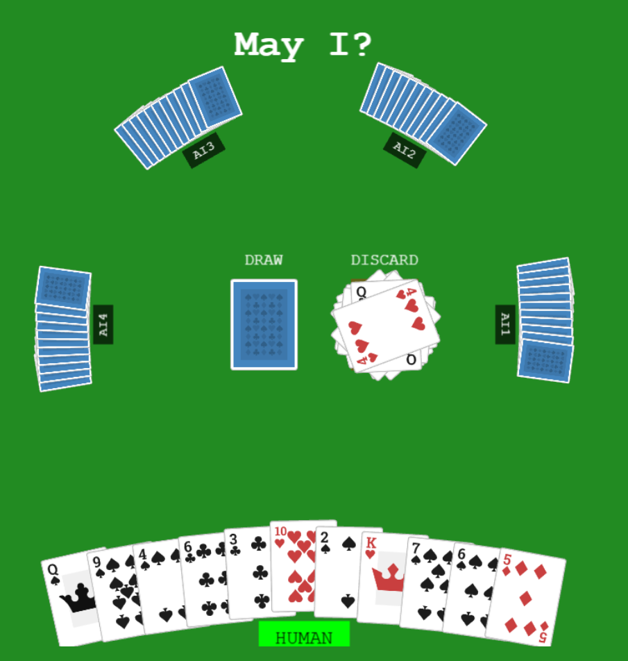

# May I?: Klennedy Rummy Card Game Variant

This is a card game based on the house rules of the Clenney family

## Overview

This variant is similar to [Continental Rummy](https://en.wikipedia.org/wiki/Continental_Rummy) with some key differences.

- 3 52-card decks are used, each player is dealt 11 cards.
- Maximum of 8 players
- If a "May I" is requested during your turn, you have the option to give them your draw as their penalty, giving you an additional draw chance.
- On the final hand, you must go out on the drop. You can have nothing left in your hand.

### Hand Melds

**Sets**: three of a kind, any suit.
**Runs**: sequential card of the same suit.

- 2 Sets
- 1 Run, 1 Set
- 2 Runs
- 3 Sets
- 2 Sets, 1 Run
- 2 Runs, 1 Set
- 3 Runs
